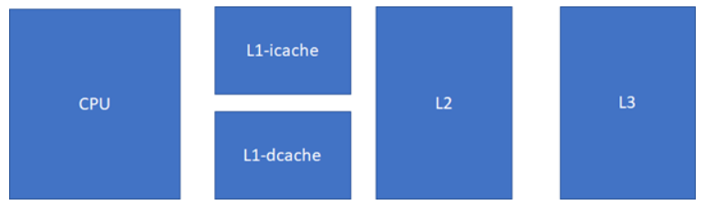
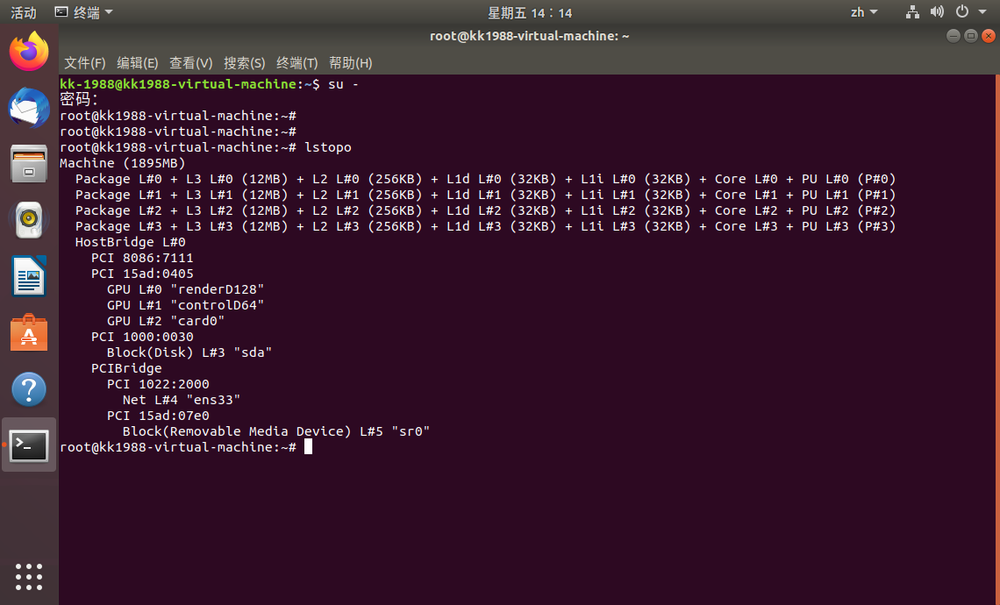

#### cache 整体概述
1. 现代CPU中，比较接近改进的哈佛结构，cache结果如下图：

L1速度 > L2速度 > L3速度 > RAM
L1容量 < L2容量 < L3容量 < RAM
* L1 cache的指令和数据是分离的，这样可以实现高速公路并行访问，CPU可以同时load指令和数据。
* 

2. 在多核中，cache的排布如下：

以上排布是vmware中，ubuntu 18.04中输入lstopo命令后的截图。我们应该尽可能追求cache命中率高，以避免延迟，最好是低级cache的命中率越高越好。

#### cache 组织
1. 

